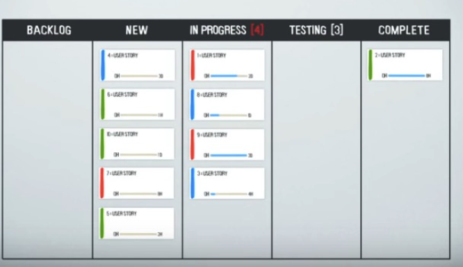

# SDLC (System Development Life Cycle)
The entire process consisting of all activities that are part of systems analysis, ststems design, building, testing, implementing, and maintaining the system.
- identify the problem or need and get approval
- plan and monitor the project
- discover and understand the details of the problem or need
- design the system components that solve the problem or satisfy the need
- build, test, and integrate system components
- complete system tests and then deploy the solution

# Predictive vs Adaptive SDLC

The choice of SDLC can vary depending on the project. Projects can fall on a continuum between predictive and adaptive approaches. 

Predictive approaches, such as the Waterfall model, assume that the project can be planned in advance and that the system can be developed according to the plan. These approaches typically have sequential phases and assume that requirements are well understood and there is low technical risk.

On the other hand, adaptive approaches, such as the Spiral model or Agile methods like Scrum, Kanban, Lean, or XP, assume that the project must be more flexible and adapt to changing needs as the project progresses. These approaches follow an iterative model and assume that requirements and needs are uncertain and evolve as the project continues.

Therefore, the choice of SDLC approach depends on factors such as the level of understanding of requirements, the level of technical risk, and the need for flexibility and adaptability in the project.

Examples of projects that would require a predictive SDLC approach include building a bridge, constructing a large-scale infrastructure project, or developing a software system with well-defined requirements and low technical risk.

Examples of projects that would require an adaptive SDLC approach include developing a new mobile app, creating a website with evolving user requirements, or implementing a complex business process that may change over time.

# Agile Development Philosophies & Values
The philosophies and values of agile development are as follows:

1. Responding to change over following a plan: Agile development prioritizes the ability to adapt and respond to changes in requirements and circumstances rather than rigidly sticking to a predetermined plan.

2. Individuals and interactions over processes and tools: Agile development emphasizes the importance of collaboration and communication among team members, valuing their skills and expertise over relying solely on processes and tools.

3. Working software over comprehensive documentation: Agile development focuses on delivering functional software that meets the needs of the customer rather than extensive documentation. While documentation is still important, it is not the primary measure of progress.

4. Customer collaboration over contract negotiation: Agile development promotes active involvement and collaboration with the customer throughout the development process. This ensures that the final product meets their expectations and needs.

These philosophies and values are outlined in the "Manifesto for Agile Development" and are followed by agile development teams to guide their approach to building information systems.

# Why Agile

Agile development promotes fixed quality by emphasizing continuous attention to technical excellence and good design. By focusing on these aspects, agile teams can ensure that the software they deliver meets the desired level of quality.

As for discovering scope, agile development encourages flexibility and welcomes changing requirements, even late in the development process. This means that the scope of the project can be adjusted and refined as new information and insights emerge. Agile teams work closely with business people and stakeholders to understand their needs and collaborate on defining and refining the scope throughout the project.

# When Agile

## Cynefin
The Cynefin framework can be applied to Agile methodologies to better understand and navigate the complexities of software development and project management. Here's how the Cynefin domains relate to Agile practices:

1. **Obvious (formerly Simple)**:
   - **Agile Application**: Routine tasks or user stories that have been done multiple times before and have a well-understood solution can fall into this domain. For instance, setting up a standard login page for a web application.
   - **Approach**: Use standard procedures or best practices. This might be where a team uses a template or a previously established pattern.

2. **Complicated**:
   - **Agile Application**: Problems that require expertise but can be solved through analysis. For instance, optimizing a database query or designing a new feature based on well-understood requirements.
   - **Approach**: Engage experts, conduct spikes (research tasks), or use techniques like user story mapping to break down and understand the problem. Solutions are often derived from good practices.

3. **Complex**:
   - **Agile Application**: Most new feature development in Agile falls into this domain. The outcome is uncertain, and the solution emerges through experimentation. For example, developing a new user interface where user behavior is unpredictable.
   - **Approach**: Use iterative development, frequent feedback loops, and adapt based on feedback. This is where Agile shines, as short sprints, regular retrospectives, and close collaboration with stakeholders allow for continuous adjustment and learning.

4. **Chaotic**:
   - **Agile Application**: Urgent issues like critical production bugs where immediate action is needed. The primary goal is to stabilize the situation.
   - **Approach**: Quick fixes to bring the system back to a stable state, followed by a more in-depth analysis to prevent recurrence. In Agile terms, this might be a "hotfix" followed by a retrospective to understand the root cause.

5. **Disorder**:
   - **Agile Application**: When a team is unsure about the nature of a problem or challenge. For instance, when there's ambiguity in requirements or stakeholder expectations.
   - **Approach**: The team needs to collaborate, possibly conduct workshops or brainstorming sessions, to clarify and move the problem to one of the other domains.

In the context of Agile, the Cynefin framework can be a powerful tool for teams to categorize challenges and decide on the best approach. It can guide teams on when to follow established patterns, when to engage in deep analysis, when to experiment, and when to act immediately. It also underscores the importance of feedback and adaptation, core principles of Agile methodologies.

# The Right Conditions for Agile

Let's explore the favorable and unfavorable conditions for Agile practices in each of these environments:

1. **Market Environment**:
   - **Favorable Conditions**:
     - Fast-changing markets where quick adaptation is crucial.
     - Markets where customer preferences evolve rapidly.
     - Competitive environments where time-to-market is a key differentiator.
     - **Tech Startups** in the mobile app space. The mobile app market is highly dynamic, with user preferences and technology trends changing rapidly. Agile practices allow startups to adapt quickly, release updates frequently, and stay competitive.
   - **Unfavorable Conditions**:
     - Stable markets with well-established products and little change.
     - Markets where long-term planning and predictability are more valued than agility.
     - **Utilities** like electricity and water supply. These markets are generally stable with long-established infrastructures and regulatory constraints, making rapid changes and adaptations less common.

2. **Customer Involvement**:
   - **Favorable Conditions**:
     - Active customer engagement and regular feedback.
     - Customers who are willing to collaborate and co-create solutions.
     - Short feedback loops with customers.
     - **Software-as-a-Service (SaaS)** companies. These companies often have direct channels of communication with their users. Regular feedback through forums, support tickets, and direct interactions allow for iterative improvements.
   - **Unfavorable Conditions**:
     - Distant or disengaged customers.
     - Environments where customer feedback is infrequent or non-existent.
     - Customers who expect a fully finished product without iterative involvement.
     - **Heavy Machinery Manufacturing**. Customers in this space often expect a finished, reliable product and might not be involved in the iterative development process.

3. **Innovation Type**:
   - **Favorable Conditions**:
     - Projects that involve high uncertainty and exploration.
     - When creating new products or features without a clear blueprint.
     - Environments that value experimentation and learning.
     - **Biotech Startups** working on cutting-edge research. The nature of scientific exploration involves a lot of uncertainty, and Agile can help in navigating the unknowns, testing hypotheses, and iterating based on findings.
   - **Unfavorable Conditions**:
     - Incremental innovation where changes are minor and well-understood.
     - Projects that are more about scaling or mass-producing an existing solution.
     - **Generic Pharmaceutical Companies**. When producing generic drugs, the innovation is incremental, with a clear blueprint already in place.

4. **Modularity of Work**:
   - **Favorable Conditions**:
     - Projects that can be broken down into smaller, independent modules or features.
     - Work that allows for incremental delivery and iterative improvement.
     - Teams that can work on different modules in parallel.
     - **Video Game Development**. Games can be developed in modules, such as levels, characters, or game mechanics. Agile allows for parallel development and iterative testing of these modules.
   - **Unfavorable Conditions**:
     - Highly interdependent work where one piece can't be completed without another.
     - Projects that require a big bang approach or can't be modularized.
     - **Large Infrastructure Projects** like dam or bridge construction. These projects have a high degree of interdependency, where one phase often can't be completed without finishing another.

5. **Impact of Interim Mistakes**:
   - **Favorable Conditions**:
     - Environments where mistakes are seen as learning opportunities.
     - Projects where interim mistakes have minimal consequences.
     - A culture that values retrospection and continuous improvement.
     - **E-commerce Websites**. Mistakes like a minor bug in a user interface can be quickly fixed with minimal impact, and lessons can be learned for future iterations.
   - **Unfavorable Conditions**:
     - High-stakes environments where mistakes can have severe repercussions (e.g., medical or aerospace industries).
     - Projects where mistakes can lead to significant financial or reputational damage.
     - Environments where there's a low tolerance for error.
     - **Aerospace Industry**. Mistakes in the design or manufacturing of aircraft components can have catastrophic consequences, making a highly cautious and thorough approach essential.

By understanding these environments and their favorable and unfavorable conditions, Agile teams can better tailor their practices and approaches to maximize success.

# Hybrid Agile Approaches: Water-Scrum-Fall
Hybrid agile approaches, such as the Water-Scrum-Fall methodology, combine elements of traditional waterfall and agile methodologies. The Water-Scrum-Fall approach recognizes that many organizations still have certain requirements, processes, and constraints that make a pure agile approach challenging to implement.

In the Water-Scrum-Fall methodology, the development process is divided into three phases: water, scrum, and fall. The "**water**" phase represents the traditional waterfall approach, where the initial planning, requirements gathering, and design activities are performed upfront. This phase aims to establish a clear understanding of the project scope and deliverables.

Once the water phase is complete, the project moves into the "**scrum**" phase, which follows agile principles. In this phase, the development team works in short iterations, typically two to four weeks, to deliver working software increments. The team collaborates closely with stakeholders, continuously gathering feedback and adjusting priorities.

After the scrum phase, the project enters the "**fall**" phase, which resembles the traditional waterfall approach again. This phase includes activities like system testing, integration, and deployment. It focuses on ensuring the stability and quality of the software before its final release.

The Water-Scrum-Fall methodology acknowledges the need for upfront planning and documentation, which aligns with the waterfall approach. However, it also incorporates agile principles like iterative development and frequent stakeholder collaboration. This hybrid approach allows organizations to balance the benefits of both methodologies while adapting to their specific needs and constraints.

# Kanban
Kanban is a method used in project management and software development to visualize and manage work. It originated from the Toyota Production System and is based on the concept of using visual cues to signal the need for action. In Kanban, work items are represented as cards or sticky notes, which are placed on a board that is divided into columns representing different stages of the workflow. As work progresses, the cards are moved from one column to the next, providing a clear visual representation of the work in progress. Kanban helps teams to visualize their work, limit work in progress, and improve overall efficiency and productivity.

The Kanban board would have columns representing different stages of the workflow: Backlog, New, In Progress, Testing, and Complete.

Here's a hypothetical example for Amazon:

Backlog:

    Implement a new recommendation algorithm to suggest products based on user's browsing history.
    Design a new checkout button to make it more prominent.
    Research on integrating a new payment gateway.
    Improve mobile responsiveness for product pages.
New:

    Develop a feature to allow users to create and  share wish lists.
    Design a new layout for the user account dashboard.
In Progress:

    Update the user review section to include video reviews.
    Optimize the search function to handle misspelled product names.
Testing:

    Implement two-factor authentication for user logins.
    Add a feature for users to tag products in their reviews (e.g., "Runs Large", "High Quality").
Complete:

    Redesign the product page layout for better user experience.
    Integrate a chatbot for customer service inquiries.
    Implement dark mode for the mobile app.

In a real-world scenario, each item on the Kanban board would likely be broken down into more detailed tasks, and there would be collaboration between various teams (e.g., design, development, QA). The board would be continuously updated, with tasks moving from one column to the next as they progress through the workflow. The goal of the Kanban system is to visualize the workflow, identify bottlenecks, and ensure a smooth flow of tasks from start to finish.

# Conclusion
In the future, Agile processes will become less about a particular method such as Scrum or eXtreme Programming (XP) and more about applying the right mix of practices and techniques to the situation and the problem. Application development professionals will apply the most appropriate hybrid process to each problem. This hybrid could be a combination of waterfall, Agile, and other techniques such as Kanban. The result will be more robust, flexible process that evolves in response to the situation rather than a well-documented, inflexible process that assumes that all problems are the same. These processes will be about more than just development; they will also address operations concerns and, more importantly, business change. And of course they will be agile!